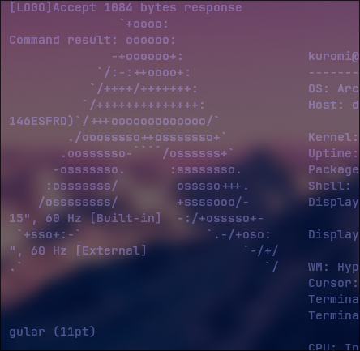
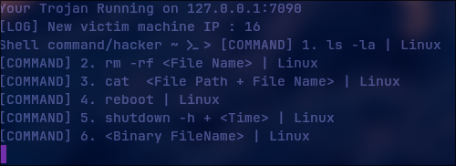
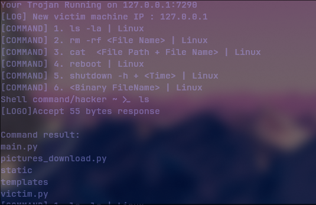
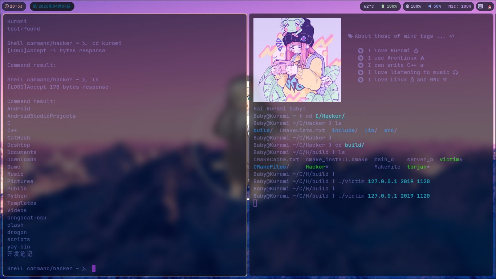
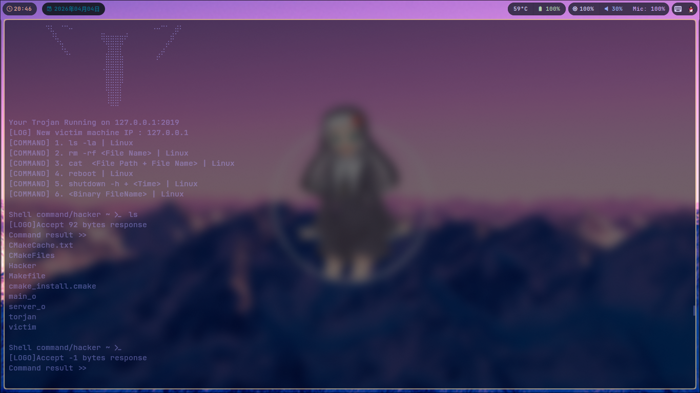
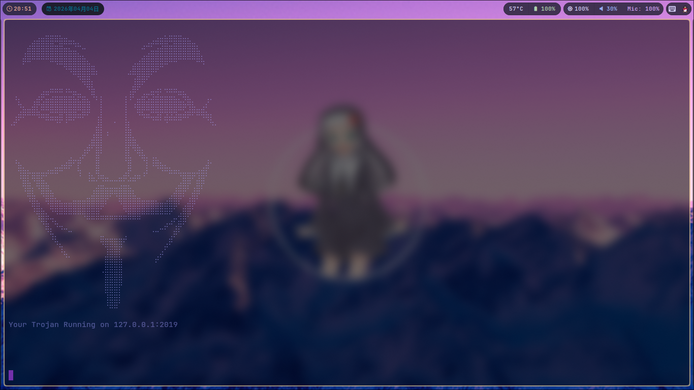
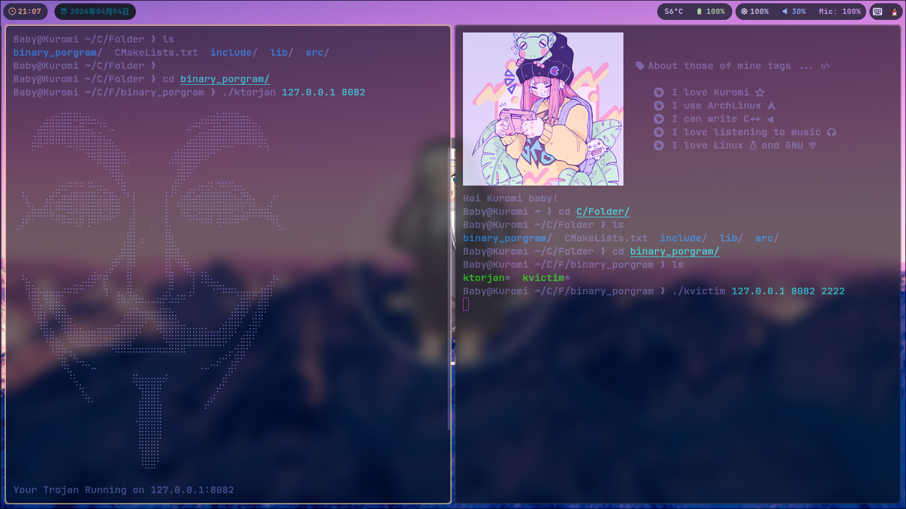
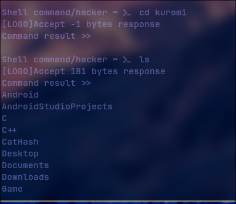
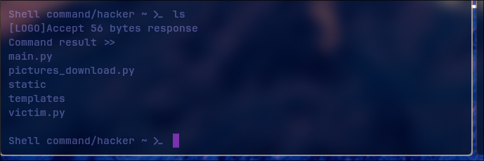

# Hai this my fourth porject ! | Ktorjan Horse - C

### A brief introduction to the reasons for writing about him :
It is also my first project written in C. My C fundamentals are not particularly strong, so I hope you can understand. I was purely attracted by interest and the elegant, straightforward syntax of C.

```Bash

⠀⠀⠀⠀⠀⣠⣴⣶⣿⣿⠿⣷⣶⣤⣄⡀⠀⠀⠀⠀⠀⠀⠀⠀⠀⠀⠀⠀⠀⠀⢀⣠⣴⣶⣷⠿⣿⣿⣶⣦⣀⠀⠀⠀⠀⠀
⠀⠀⠀⢀⣾⣿⣿⣿⣿⣿⣿⣿⣶⣦⣬⡉⠒⠀⠀⠀⠀⠀⠀⠀⠀⠀⠀⠀⠀⠚⢉⣥⣴⣾⣿⣿⣿⣿⣿⣿⣿⣧⠀⠀⠀⠀
⠀⠀⠀⡾⠿⠛⠛⠛⠛⠿⢿⣿⣿⣿⣿⣿⣷⣄⠀⠀⠀⠀⠀⠀⠀⠀⠀⢀⣠⣾⣿⣿⣿⣿⣿⠿⠿⠛⠛⠛⠛⠿⢧⠀⠀⠀
⠀⠀⠀⠀⠀⠀⠀⠀⠀⠀⠀⠀⠙⠻⣿⣿⣿⣿⣿⡄⠀⠀⠀⠀⠀⠀⣠⣿⣿⣿⣿⡿⠟⠉⠀⠀⠀⠀⠀⠀⠀⠀⠀⠀⠀⠀
⠀⠀⠀⠀⠀⠀⠀⠀⠀⠀⠀⠀⠀⠀⠀⠙⢿⣿⡄⠀⠀⠀⠀⠀⠀⠀⠀⢰⣿⡿⠋⠀⠀⠀⠀⠀⠀⠀⠀⠀⠀⠀⠀⠀⠀⠀
⠀⠀⠀⠀⠀⠀⠀⣠⣤⠶⠶⠶⠰⠦⣤⣀⠀⠙⣷⠀⠀⠀⠀⠀⠀⠀⢠⡿⠋⢀⣀⣤⢴⠆⠲⠶⠶⣤⣄⠀⠀⠀⠀⠀⠀⠀
⠀⠘⣆⠀⠀⢠⣾⣫⣶⣾⣿⣿⣿⣿⣷⣯⣿⣦⠈⠃⡇⠀⠀⠀⠀⢸⠘⢁⣶⣿⣵⣾⣿⣿⣿⣿⣷⣦⣝⣷⡄⠀⠀⡰⠂⠀
⠀⠀⣨⣷⣶⣿⣧⣛⣛⠿⠿⣿⢿⣿⣿⣛⣿⡿⠀⠀⡇⠀⠀⠀⠀⢸⠀⠈⢿⣟⣛⠿⢿⡿⢿⢿⢿⣛⣫⣼⡿⣶⣾⣅⡀⠀
⢀⡼⠋⠁⠀⠀⠈⠉⠛⠛⠻⠟⠸⠛⠋⠉⠁⠀⠀⢸⡇⠀⠀⠄⠀⢸⡄⠀⠀⠈⠉⠙⠛⠃⠻⠛⠛⠛⠉⠁⠀⠀⠈⠙⢧⡀       Ktorjan - C lanague
⠀⠀⠀⠀⠀⠀⠀⠀⠀⠀⠀⠀⠀⠀⠀⠀⠀⠀⢀⣿⡇⢠⠀⠀⠀⢸⣷⠀⠀⠀⠀⠀⠀⠀⠀⠀⠀⠀⠀⠀⠀⠀⠀⠀⠀⠀  Author : Kloveme Create at : 2026/4/4
⠀⠀⠀⠀⠀⠀⠀⠀⠀⠀⠀⠀⠀⠀⠀⠀⠀⢀⣾⣿⡇⠀⠀⠀⠀⢸⣿⣷⡀⠀⠀⠀⠀⠀⠀⠀⠀⠀⠀⠀⠀⠀⠀⠀⠀⠀      Language : C 99 Version
⠀⠀⠀⠀⠀⠀⠀⠀⠀⠀⠀⠀⠀⠀⠀⠀⣰⠟⠁⣿⠇⠀⠀⠀⠀⢸⡇⠙⢿⣆⠀⠀⠀⠀⠀⠀⠀⠀⠀⠀⠀⠀⠀⠀⠀⠀     License: MIT | Open-Source 
⠀⠰⣄⠀⠀⠀⠀⠀⠀⠀⠀⢀⣠⣾⠖⡾⠁⠀⠀⣿⠀⠀⠀⠀⠀⠘⣿⠀⠀⠙⡇⢸⣷⣄⡀⠀⠀⠀⠀⠀⠀⠀⠀⣰⠄⠀
⠀⠀⢻⣷⡦⣤⣤⣤⡴⠶⠿⠛⠉⠁⠀⢳⠀⢠⡀⢿⣀⠀⠀⠀⠀⣠⡟⢀⣀⢠⠇⠀⠈⠙⠛⠷⠶⢦⣤⣤⣤⢴⣾⡏⠀⠀
⠀⠀⠈⣿⣧⠙⣿⣷⣄⠀⠀⠀⠀⠀⠀⠀⠀⠘⠛⢊⣙⠛⠒⠒⢛⣋⡚⠛⠉⠀⠀⠀⠀⠀⠀⠀⠀⣠⣿⡿⠁⣾⡿⠀⠀⠀
⠀⠀⠀⠘⣿⣇⠈⢿⣿⣦⠀⠀⠀⠀⠀⠀⠀⠀⣰⣿⣿⣿⡿⢿⣿⣿⣿⣆⠀⠀⠀⠀⠀⠀⠀⢀⣼⣿⡟⠁⣼⡿⠁⠀⠀⠀
⠀⠀⠀⠀⠘⣿⣦⠀⠻⣿⣷⣦⣤⣤⣶⣶⣶⣿⣿⣿⣿⠏⠀⠀⠻⣿⣿⣿⣿⣶⣶⣶⣦⣤⣴⣿⣿⠏⢀⣼⡿⠁⠀⠀⠀⠀
⠀⠀⠀⠀⠀⠘⢿⣷⣄⠙⠻⠿⠿⠿⠿⠿⢿⣿⣿⣿⣁⣀⣀⣀⣀⣙⣿⣿⣿⠿⠿⠿⠿⠿⠿⠟⠁⣠⣿⡿⠁⠀⠀⠀⠀⠀
⠀⠀⠀⠀⠀⠀⠈⠻⣯⠙⢦⣀⠀⠀⠀⠀⠀⠉⠉⠉⠉⠉⠉⠉⠉⠉⠉⠉⠉⠀⠀⠀⠀⠀⣠⠴⢋⣾⠟⠀⠀⠀⠀⠀⠀⠀
⠀⠀⠀⠀⠀⠀⠀⠀⠙⢧⡀⠈⠉⠒⠀⠀⠀⠀⠀⠀⣀⠀⠀⠀⠀⢀⠀⠀⠀⠀⠀⠐⠒⠉⠁⢀⡾⠃⠀⠀⠀⠀⠀⠀⠀⠀
⠀⠀⠀⠀⠀⠀⠀⠀⠀⠈⠳⣄⠀⠀⠀⠀⠀⠀⠀⠀⠻⣿⣿⣿⣿⠋⠀⠀⠀⠀⠀⠀⠀⠀⣠⠟⠀⠀⠀⠀⠀⠀⠀⠀⠀⠀
⠀⠀⠀⠀⠀⠀⠀⠀⠀⠀⠀⠘⢦⡀⠀⠀⠀⠀⠀⠀⠀⣸⣿⣿⡇⠀⠀⠀⠀⠀⠀⠀⢀⡴⠁⠀⠀⠀⠀⠀⠀⠀⠀⠀⠀⠀
⠀⠀⠀⠀⠀⠀⠀⠀⠀⠀⠀⠀⠀⠀⠀⠀⠀⠀⠀⠀⠀⣿⣿⣿⣿⠀⠀⠀⠀⠀⠀⠀⠋⠀⠀⠀⠀⠀⠀⠀⠀⠀⠀⠀⠀⠀
⠀⠀⠀⠀⠀⠀⠀⠀⠀⠀⠀⠀⠀⠀⠀⠀⠀⠀⠀⠀⠐⣿⣿⣿⣿⠀⠀⠀⠀⠀⠀⠀⠀⠀⠀⠀⠀⠀⠀⠀⠀⠀⠀⠀⠀⠀
⠀⠀⠀⠀⠀⠀⠀⠀⠀⠀⠀⠀⠀⠀⠀⠀⠀⠀⠀⠀⠀⣿⣿⣿⡿⠀⠀⠀⠀⠀⠀⠀⠀⠀⠀⠀⠀⠀⠀⠀⠀⠀⠀⠀⠀⠀
⠀⠀⠀⠀⠀⠀⠀⠀⠀⠀⠀⠀⠀⠀⠀⠀⠀⠀⠀⠀⠀⢻⣿⣿⡇⠀⠀⠀⠀⠀⠀⠀⠀⠀⠀⠀⠀⠀⠀⠀⠀⠀⠀⠀⠀⠀
⠀⠀⠀⠀⠀⠀⠀⠀⠀⠀⠀⠀⠀⠀⠀⠀⠀⠀⠀⠀⠀⠸⣿⣿⠃⠀⠀⠀⠀⠀⠀⠀⠀⠀⠀⠀⠀⠀⠀⠀⠀⠀⠀⠀⠀⠀

```

### Update
I updated Kvictim.h
kvictim_lib.cc
kvictim.c
I rewrote the victim machine, and now it has a C API. Tomorrow I will write how to use the victim machine API.

### Ktorjan usage

```c
1. include headers file

#include "../include/server.h" //This torjan core!!!
#include <stdio.h>
#include <stdlib.h>
#include <sys/types.h>
#include <stdio.h>
```
```c
2.Create a Main function that supports inputting function signatures, namely [argc] [argv]

int main (int argc , char* argv[]) {

}
```

```c
3.Commands obtained from bound functions

char* server_host = argv[1];
u_int64_t server_port = atoi(argv[2]);
```
```c
4.Create a socket node, execute the structure, and pass it to the Init_socket function

struct sock_data sock_d = init_socket(&server_port, server_host);
struct execute_data exec_d;
```

```c
5.Just call 'start_server'
//Note that the call order requires configuration before calling, otherwise the configuration will be empty!
start_server(&sock_d , &exec_d);
```
```cmake

###This my make config
cmake_minimum_required(VERSION 3.15)
project(KTorjan C)

set(HEADERS 
  ../Folder/include/
)
set(SOURCES 
   ../Folder/lib/ktorjan_lib.c
   ../Folder/lib/kvictim_lib.c
)
add_executable(ktorjan ../Folder/src/ktorjan.c   
  ../Folder/lib/ktorjan_lib.c)

add_executable(kvictim ../Folder/src/kvictim.c
  ../Folder/lib/kvictim_lib.c)

find_package(Threads REQUIRED)
target_link_libraries(kvictim Threads::Threads)
```
### About Cross-Platform Tool Issues 
I am trying hard to think of ways to help me. 
You can join my email to tell me.

```email
Xingxixi335@gmail.com
```
### About Kvictim.c API
As for the control side, I hope I can make it into a simple C API to tell you all, since the implementation is rather messy.

### This use video


### This use pictures












### About a CatHash author
And the author name in my CatHash comments uses another of my email-registered GitHub accounts, so I did not seize someone else's project.

### About my Web framework cross-platform issues
I am working hard to support Windows and MacOS. I don't have much personal time, plus I have to go to school
